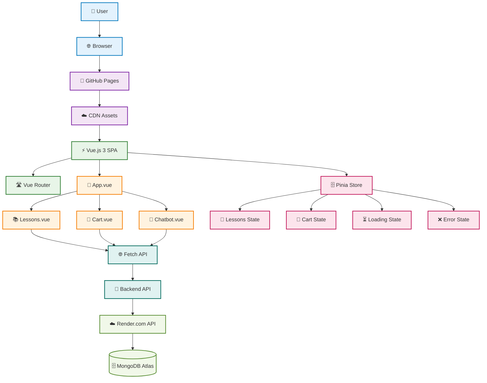
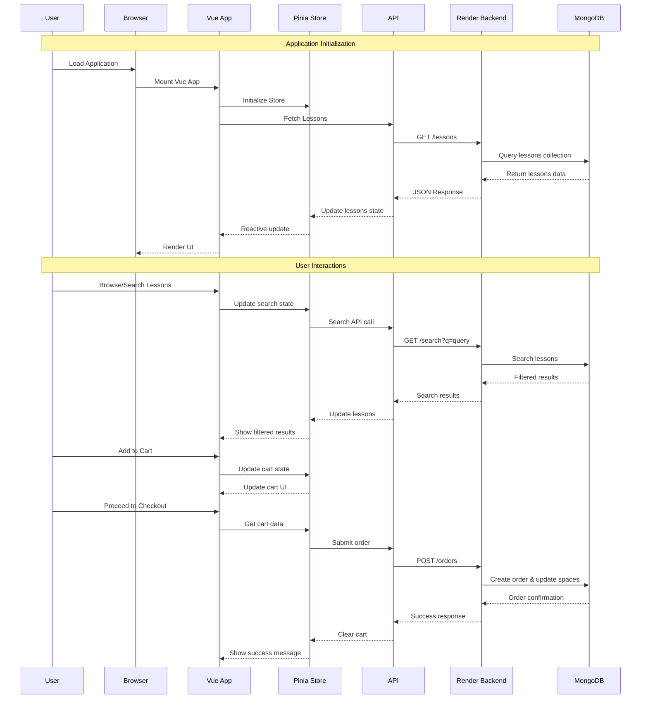
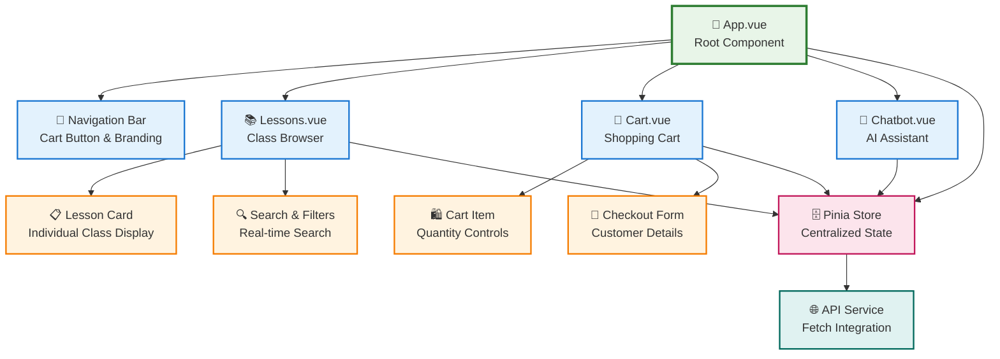

# After-School Classes E-Commerce - Frontend

> **Vue.js 3 SPA** | **Pinia State Management** | **Hosted on GitHub Pages**

[](https://dima336l.github.io/E-Commerce-Frontend/#/lessons)
[](https://vuejs.org/)
[](https://pages.github.com/)

**🌐 Live on GitHub Pages:** [https://dima336l.github.io/E-Commerce-Frontend/#/lessons](https://dima336l.github.io/E-Commerce-Frontend/#/lessons)  
**📦 Backend API:** [E-Commerce-Backend](https://github.com/Dima336l/E-Commerce-Backend)

---

## 🎯 Project Overview

Full-stack e-commerce platform for booking after-school educational classes. Built for **CST3144 Full Stack Development** coursework, demonstrating modern frontend development practices with Vue.js 3.

**Student:** Dumitru (Dima336l) | **Institution:** Middlesex University

---

## 🏗️ Frontend Architecture



### 🔄 Component Data Flow



### 🧩 Component Architecture



---

## ✨ What I Built

### Core Features
- ✅ **Browse & Search** - 10+ lessons with real-time backend search (300ms debouncing)
- ✅ **Sort & Filter** - By subject, location, price, availability (asc/desc)
- ✅ **Shopping Cart** - Add/remove items with live inventory tracking
- ✅ **Checkout** - Form validation (name: letters only, phone: numbers only)
- ✅ **Order System** - POST to backend API with success confirmation
- ✅ **Responsive UI** - Mobile-first design with smooth animations

### Technical Achievements
- ✅ **Pinia Store** - Centralized state management for lessons & cart
- ✅ **Vue Router** - Client-side routing (hash mode for GitHub Pages)
- ✅ **Fetch API** - All HTTP requests (no Axios, per requirements)
- ✅ **Backend Integration** - Connected to Express.js API on Render.com
- ✅ **Search As You Type** - Backend search with debouncing (+10% bonus)
- ✅ **Form Validation** - Regex patterns for real-time validation
- ✅ **GitHub Actions** - Automated deployment to GitHub Pages

---

## 🛠 Tech Stack

**Framework:** Vue.js 3 | **State:** Pinia | **Router:** Vue Router | **Build:** Vite  
**HTTP:** Fetch API | **Icons:** Font Awesome | **Deploy:** GitHub Pages

---

## 🚀 Getting Started

### Prerequisites

- **Node.js** 14.x or higher
- **npm** or **yarn**
- **Backend API** running (see [backend repo](https://github.com/Dima336l/E-Commerce-Backend))

### Installation

1. **Clone the repository**
   ```bash
   git clone https://github.com/Dima336l/E-Commerce-Frontend.git
   cd E-Commerce-Frontend
   ```

2. **Install dependencies**
   ```bash
   npm install
   ```

3. **Configure API endpoint** (optional)
   
   The app automatically uses:
   - **Development:** `http://localhost:3000`
   - **Production:** `https://e-commerce-backend-w46y.onrender.com`
   
   To override, create `.env`:
   ```env
   VITE_API_URL=http://your-custom-backend-url
   ```

4. **Start development server**
   ```bash
   npm run dev
   ```
   
   App runs at: `http://localhost:5173`

### Build for Production

```bash
# Create production build
npm run build

# Preview production build locally
npm run preview
```

Build output: `dist/` folder

---

## 📁 Project Structure

```
src/
├── views/
│   ├── Lessons.vue         # Browse lessons, search, sort, add to cart
│   └── Cart.vue            # Shopping cart & checkout form
├── stores/
│   └── index.js            # Pinia store (state, getters, actions)
├── router/
│   └── index.js            # Vue Router (hash mode)
├── App.vue                 # Root layout (navbar, footer, router-view)
├── main.js                 # App entry point
└── config.js               # API base URL config
```

**Key Files:**
- `stores/index.js` - All state management (lessons, cart, API calls)
- `views/Lessons.vue` - Main browsing page with search/sort
- `views/Cart.vue` - Checkout page with form validation
- `config.js` - Switches between local/production API

---

## 🔌 API Integration

**Backend:** `https://e-commerce-backend-w46y.onrender.com`

| Endpoint | Method | Purpose |
|----------|--------|---------|
| `/lessons` | GET | Fetch all lessons |
| `/search?q=query` | GET | Search lessons (backend) |
| `/orders` | POST | Submit order |
| `/lessons/:id` | PUT | Update lesson space |

**Search Implementation:**
```javascript
// 300ms debounced search
handleSearch() {
  clearTimeout(this.searchTimeout)
  this.searchTimeout = setTimeout(async () => {
    await this.store.searchLessonsBackend(this.searchQuery)
  }, 300)
}
```

---

## 🌐 Deployment - GitHub Pages

**🔗 Hosted at:** [https://dima336l.github.io/E-Commerce-Frontend/#/lessons](https://dima336l.github.io/E-Commerce-Frontend/#/lessons)  
**Platform:** GitHub Pages (Free Static Hosting)  
**Method:** Automated via GitHub Actions

**How it works:**
```bash
npm run build           # Creates dist/ folder
git push origin main    # Triggers GitHub Actions
# → Automatically deploys to gh-pages branch
# → Live at dima336l.github.io/E-Commerce-Frontend
```

**GitHub Pages Configuration:**
- ✅ Hash routing (`createWebHashHistory`) for client-side routing support
- ✅ Automatic HTTPS via GitHub
- ✅ API URL auto-switches: dev → `localhost:3000`, production → Render.com
- ✅ CORS configured on backend to accept requests from GitHub Pages URL

---

## 🎓 Coursework Requirements Met

**Vue.js (100%):** v-for, v-on, v-model, computed properties, component architecture  
**Features (100%):** 10+ lessons, sort (4 fields, asc/desc), cart management, checkout validation  
**API (100%):** Native Fetch API (no Axios), GET/POST/PUT endpoints  
**Validation (100%):** Regex patterns - name: `/^[a-zA-Z\s]+$/`, phone: `/^[0-9]+$/`  
**Bonus (+10%):** Backend search "as you type" with 300ms debouncing

---

## 🔧 Development

```bash
npm install      # Install dependencies
npm run dev      # Start dev server (http://localhost:5173)
npm run build    # Build for production
```

**State Management Example:**
```javascript
// Pinia store structure
state: { lessons: [], cart: [], loading, error }
getters: { cartTotal, cartItemCount }
actions: { fetchLessons(), submitOrder(), addToCart() }
```

---

## 🔗 Links

**Frontend (GitHub Pages):**  
- 🌐 **Live App:** [https://dima336l.github.io/E-Commerce-Frontend/#/lessons](https://dima336l.github.io/E-Commerce-Frontend/#/lessons)  
- 📂 **Repository:** [github.com/Dima336l/E-Commerce-Frontend](https://github.com/Dima336l/E-Commerce-Frontend)

**Backend (Render.com):**  
- 🔌 **API:** [https://e-commerce-backend-w46y.onrender.com](https://e-commerce-backend-w46y.onrender.com)  
- 📂 **Repository:** [github.com/Dima336l/E-Commerce-Backend](https://github.com/Dima336l/E-Commerce-Backend)

---

**Built by Dumitru (Dima336l)** | CST3144 Full Stack Development | Middlesex University 2024-25
